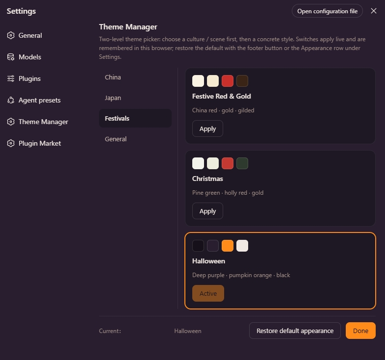

# dsh-theme-manager

A two-level theme manager for the DeepSeek Harness Web UI: **pick a culture / scene first, then a concrete style**.

中文说明: [README.md](README.md)



## Features

- **Two-level picker**: Settings → Theme Manager (a `settings.section` page) — category list on the left, style cards (with color swatches) on the right.
- **Applies live**: every style is registered as a real theme through the `theme` service (`--dsw-alias-*` token overrides) — click *Apply* and the UI re-skins instantly, no refresh. The styles also appear as extra color cubes in the built-in **Appearance** row.
- **Remembered**: the active style is kept in the browser's localStorage (`dsh.themeManager.active`) and restored on reload; switching back to a built-in appearance (Light / Dark / System) clears it.
- **Bilingual**: copy follows the UI language via the `locale` service (zh / en).

## Built-in styles

**20 styles** are bundled (13 light-base · 7 dark-base):

| Layer 1 | Style | Palette |
|---|---|---|
| China | Ink Wash | Rice-paper white · ink-black primary · vermilion accents |
| China | Suzhou Garden | White walls & dark tiles · bamboo green |
| China | Forbidden City | Vermilion walls · gilded accents |
| China | Azure Landscape | Mineral blue · malachite green · ochre |
| China | Guochao Neon 🌙 | China red · neon cyan on ink night |
| Japan | Ukiyo-e | Washi ivory · ultramarine primary · ochre-red & mustard |
| Japan | Wabi-sabi | Muted rice-grey · zen minimalism |
| Japan | Sakura | Cherry-blossom pink · white · fresh green |
| Japan | Edo Night 🌙 | Indigo night · paper-lantern amber |
| Japan | Tokyo Neon 🌙 | Neon pink · electric cyan |
| Festivals | Festive Red & Gold | China red · gold · gilded |
| Festivals | Christmas | Pine green · holly red · gold |
| Festivals | Halloween 🌙 | Deep purple · pumpkin orange · black |
| General | Cyberpunk 🌙 | Neon magenta · electric cyan on black |
| General | Midnight Minimal 🌙 | Pure black-grey · high contrast |
| General | Forest | Deep green · moss · cream |
| General | Ocean Breeze | Sea blue · white · teal |
| General | Morandi | Soft muted greys |
| General | Retro Film | Warm brown · faded amber |
| General | Starry Night 🌙 | Deep blue-violet · starlight |

> 🌙 = dark base (`colorScheme: "dark"`); the rest use a light base.

## Installation

Requires **dsh web 0.1.0-rc.6 or newer**.

### Option 1 — install directly from GitHub (recommended)

`dsh plugin` installs the dependency into the profile and appends it to `dsh.profile.bundles` automatically — no manual config:

```sh
dsh plugin --profile web add github:runcat-tommy/dsh-theme-manager
```

Or with the full git URL:

```sh
dsh plugin --profile web add https://github.com/runcat-tommy/dsh-theme-manager.git
```

After the install, **restart `dsh web`** and open **Settings → Theme Manager**.

> pnpm is required: `npm i -g pnpm` if you don't have it (`dsh plugin` forwards to pnpm).

### Option 2 — npm install (once published to npm)

```sh
dsh plugin --profile web add dsh-theme-manager
```

Restart `dsh web` afterwards.

### Option 3 — manual download / source install (development)

1. Get the source: on the GitHub repo page use **Code → Download ZIP**, or `git clone https://github.com/runcat-tommy/dsh-theme-manager.git`
2. Link it into the profile:

   ```sh
   # run from anywhere; point to your actual unpacked/cloned directory
   dsh plugin --profile web add link:D:/path/to/dsh-theme-manager
   ```

   Or edit `~/.dsh/profiles/web/package.json` manually:

   ```jsonc
   {
     "dependencies": {
       "dsh-theme-manager": "link:D:/path/to/dsh-theme-manager"
     },
     "dsh": {
       "profile": {
         "bundles": [/* …existing… */, "dsh-theme-manager"]
       }
     }
   }
   ```

   Then run `pnpm install` inside `~/.dsh/profiles/web`.

3. Restart `dsh web`.

## Usage

1. Open **Settings → Theme Manager**.
2. Pick a layer-1 category on the left (China / Japan / Festivals / General), then click **Apply** on a style card — the UI re-skins instantly.
3. The choice survives a page reload; to go back to the default, click **Restore default appearance** at the bottom, or switch Light / Dark / System in the **Appearance** row.

## Adding a new style

Append an entry to the `STYLES` array in `lib/client.js` (and add `CATEGORIES` plus `zh` / `en` copy). Each style declares a compact `spec` (~30 core colors); `palette()` expands it into the full `--dsw-alias-*` token map:

```js
{
  id: "suzhou-garden",          // unique id (must not collide with light/dark/system)
  category: "china",            // owning layer-1 category
  colorScheme: "light",         // base palette: "light" or "dark"
  labelKey: "style.suzhouGarden",
  descKey: "style.suzhouGardenDesc",
  swatch: ["#…", "#…", "#…", "#…"],   // card preview swatches (base / layer2 / brand / label1)
  spec: {
    base: "#f4f1e8", layer1: "#faf7ef", layer2: "#efead9", layer3: "#e5dec8",
    overlay: "#fdfbf4", platform: "#efe9d7",
    label1: "#2f2f2a", label2: "#56544a", label3: "#7d7a6c", dimmed: "#a9a491",
    onDark: "#faf7ef",              // text color on primary buttons (near-white for light, near-black for dark)
    brand: "#4a7c59",
    btnPrimary: "#2f2f2a", btnPrimaryHover: "#46443c", btnPrimaryDimmed: "#e2dcc6",
    btnInfo: "#4a7c59", btnInfoHover: "#5b8f6a",
    brandTertiary: "#dce6d4",
    error: "#a34a32", error2: "#c05a3e",
    success: "#3f7a4e", success2: "#55906a", success3: "#dce8d2",
    warn: "#a8762e", warn2: "#c2913f", warn3: "#f0e3c2", warnLabel: "#8a5f1f",
    bubble: "#e8e2cf", bubbleHi: "#dcd4b8",
    sidebar: "#eee9d8", sidebarActive: "#e3dcc4", sidebarAccent: "#c6bb97", sidebarHover: "#e9e3cf",
    toast: "#2f2f2a"
  }
}
```

Token names and semantics follow the alias layer of `@deepseek-ai/dsh-client-ui-theme` (`lib/styles/design-platform.css`).

## Layout

```
dsh-theme-manager/
├── assets/                # preview images (referenced by the READMEs)
├── package.json           # dsh.client declaration (web platform, browser-only plugin)
├── cordis.patch.yml       # bundle patch: contributes one profile row
├── README.md              # Chinese docs
├── README.en.md           # English docs
└── lib/
    ├── index.js           # host half (no-op)
    └── client.js          # browser half: style definitions + registration/restore + picker UI
```

## Roadmap

- [x] Ink Wash (China) / Ukiyo-e (Japan) sample
- [x] Expanded to 20 styles (China 5 · Japan 5 · Festivals 3 · General 7, incl. 7 dark-base)
- [ ] Configurable style list (JSON-defined, no code changes)
- [ ] light / dark dual-base for every style
- [ ] Texture enhancement (rice paper, gilded foil, wave patterns, …)
