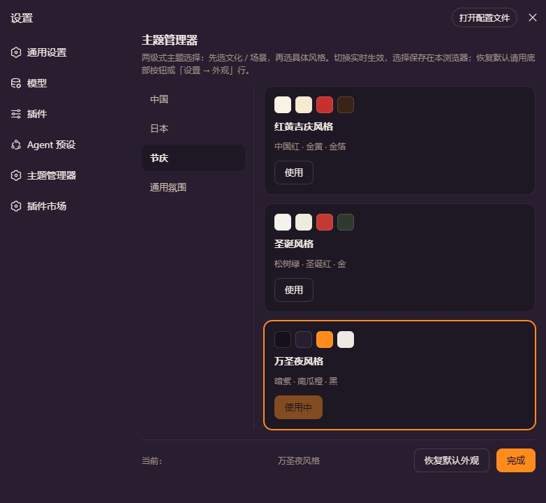

# dsh-theme-manager

两级式主题管理器（DeepSeek Harness Web 插件）：**先选文化 / 场景，再选具体风格**。

English: [README.en.md](README.en.md)



## 功能

- **两级选择 UI**：设置 → 主题管理器（`settings.section` 新页面），左侧第一层列表 + 右侧第二层风格卡片（含配色色卡预览）。
- **实时生效**：每套风格通过 `theme` 服务 `register()` 注册为真正的主题（`--dsw-alias-*` token 覆盖），点「使用」立即切换，无需刷新；同时也会出现在「设置 → 外观」行的额外色块中。
- **选择记忆**：当前风格保存在本浏览器 localStorage（`dsh.themeManager.active`），刷新/重开自动恢复；在「外观」行切回内置浅色 / 深色 / 跟随系统时自动清除。
- **中英双语**：文案跟随界面语言（`locale` 服务，zh / en）。
- **更新提醒**：启动时与每 6 小时自动检查一次 npm 最新版本；发现新版本时右下角弹一次性 toast + 常驻气泡，设置页内可**一键更新 / 忽略本版本 / 稍后提醒**。npm 与 GitHub 安装方式支持一键更新（host 半部通过 `dsh plugin` 安装并自动重启），开发链接安装（link:）只给更新指引。

## 内置风格

当前内置 **40 套风格**（文化 / 场景 20 套 + 国旗 20 套；浅色底 33 套 · 深色底 7 套）：

**文化 / 场景（第一层：中国 / 日本 / 节庆 / 通用氛围）**

| 第一层 | 第二层 | 配色意象 |
|---|---|---|
| 中国 | 水墨风格 | 宣纸白底 · 墨黑主色 · 朱砂红点缀 |
| 中国 | 苏州园林风格 | 粉墙黛瓦 · 青灰 · 竹绿 |
| 中国 | 故宫宫墙风格 | 朱红宫墙 · 鎏金点缀 |
| 中国 | 青绿山水风格 | 石青 · 石绿 · 赭石（千里江山图） |
| 中国 | 国潮霓虹风格 🌙 | 中国红 · 荧光青 · 墨夜 |
| 日本 | 浮世绘风格 | 和纸米底 · 群青主色 · 赭红与芥子黄点缀 |
| 日本 | 侘寂和风 | 低饱和米灰 · 枯山水禅意 |
| 日本 | 樱花花见风格 | 樱粉 · 素白 · 嫩芽绿 |
| 日本 | 江户夜行风格 🌙 | 深靛夜空 · 灯笼暖橙 |
| 日本 | 东京霓虹风格 🌙 | 霓虹粉 · 电光青 |
| 节庆 | 红黄吉庆风格 | 中国红 · 金黄 · 金箔 |
| 节庆 | 圣诞风格 | 松树绿 · 圣诞红 · 金 |
| 节庆 | 万圣夜风格 🌙 | 暗紫 · 南瓜橙 · 黑 |
| 通用氛围 | 赛博朋克风格 🌙 | 霓虹粉紫 · 电光青 · 深黑 |
| 通用氛围 | 暗夜极简风格 🌙 | 纯黑灰 · 高对比 |
| 通用氛围 | 森林自然风格 | 墨绿 · 苔绿 · 米白 |
| 通用氛围 | 海洋清凉风格 | 海蓝 · 白 · 青 |
| 通用氛围 | 莫兰迪低饱和 | 灰调柔和 · 高级感 |
| 通用氛围 | 复古胶片风格 | 暖棕 · 褪色黄 |
| 通用氛围 | 星空夜色风格 🌙 | 深蓝紫 · 星光白 |

> 🌙 = 深色底版（`colorScheme: "dark"`）；其余为浅色底版。

**国旗（第一层：国旗）**

两色国旗（日本、印尼、沙特、瑞士等）由 `flagSpec()` 生成器以旗帜主色为基准，通过明度派生补齐全部背景层级 / 文字 / 边框 / 状态色。

| 第一层 | 第二层 | 配色意象 |
|---|---|---|
| 国旗 | 美国 | 星条旗：海军蓝 · 星条红 · 白 |
| 国旗 | 中国 | 五星红旗：中国红 · 金黄 |
| 国旗 | 德国 | 黑 · 红 · 金 |
| 国旗 | 日本 | 日之丸：白 · 红 |
| 国旗 | 印度 | 藏红 · 白 · 绿 · 靛蓝 |
| 国旗 | 英国 | 米字旗：深蓝 · 白 · 红 |
| 国旗 | 法国 | 蓝 · 白 · 红 |
| 国旗 | 意大利 | 绿 · 白 · 红 |
| 国旗 | 加拿大 | 枫叶旗：红 · 白 |
| 国旗 | 巴西 | 绿 · 黄 · 蓝 |
| 国旗 | 俄罗斯 | 白 · 蓝 · 红 |
| 国旗 | 韩国 | 太极旗：白 · 红 · 蓝 · 黑 |
| 国旗 | 墨西哥 | 绿 · 白 · 红 |
| 国旗 | 澳大利亚 | 南十字：深蓝 · 白 · 红 |
| 国旗 | 西班牙 | 红 · 金 |
| 国旗 | 印尼 | 红 · 白 |
| 国旗 | 土耳其 | 新月：红 · 白 |
| 国旗 | 荷兰 | 红 · 白 · 蓝 |
| 国旗 | 沙特阿拉伯 | 绿 · 白 |
| 国旗 | 瑞士 | 十字：红 · 白 |

## 安装

要求：`dsh web 0.1.0-rc.6` 或更新版本。

### 方式一：从 GitHub 直接安装（推荐）

`dsh plugin` 会把依赖装进 profile 并自动加入 `dsh.profile.bundles`，无需手动改配置：

```sh
dsh plugin --profile web add github:runcat-tommy/dsh-theme-manager
```

或使用完整 git 地址：

```sh
dsh plugin --profile web add https://github.com/runcat-tommy/dsh-theme-manager.git
```

安装完成后**重启 `dsh web`**，打开 **设置 → 主题管理器** 即可使用。

> 没有装 pnpm 时，先装 pnpm：`npm i -g pnpm`（`dsh plugin` 依赖 pnpm）。

### 方式二：npm 安装（发布到 npm 后可用）

```sh
dsh plugin --profile web add dsh-theme-manager
```

同样重启 `dsh web` 生效。

### 方式三：下载源码手动安装（开发 / 调试）

1. 下载源码：GitHub 仓库页面 **Code → Download ZIP** 解压，或 `git clone https://github.com/runcat-tommy/dsh-theme-manager.git`
2. 进入源码目录，直接安装当前目录：

   ```sh
   cd dsh-theme-manager
   dsh plugin --profile web add .
   ```

   > `dsh plugin add .` 会把当前目录解析为绝对路径（file: 快照）装入 profile。如果用于开发调试、希望改动源码即时生效，改用活链接形式：

   ```sh
   dsh plugin --profile web add link:.
   ```

   也可以手动编辑 `~/.dsh/profiles/web/package.json`：

   ```jsonc
   {
     "dependencies": {
       "dsh-theme-manager": "link:D:/path/to/dsh-theme-manager"
     },
     "dsh": {
       "profile": {
         "bundles": [/* …原有… */, "dsh-theme-manager"]
       }
     }
   }
   ```

   然后在 `~/.dsh/profiles/web` 下执行 `pnpm install`。

3. 重启 `dsh web`。

## 使用

1. 打开 **设置 → 主题管理器**。
2. 左侧选第一层（中国 / 日本 / 节庆 / 通用氛围），右侧点某张风格卡片 **使用** → 界面立即换肤。
3. 刷新页面风格保留；想回到默认，点底部 **恢复默认外观**，或在 **设置 → 外观** 行切换浅色 / 深色 / 跟随系统。

## 更新提醒

启动后自动检查 npm 最新版本（每 6 小时一次，手动可在设置页底部点 **检查更新**）。发现新版本时：

1. 右下角弹出一次性 **toast**（可点「查看」进入更新对话框），常驻 **气泡** 会保留直到处理或忽略。
2. 更新对话框展示版本对比与更新内容，支持 **忽略本版本 / 稍后提醒（24 小时）/ 更新**。
3. **更新**：npm 安装方式精确安装 `dsh-theme-manager@新版本`，GitHub 安装方式解析最新 commit 后按 SHA 固定安装；安装过程实时显示进度与日志，完成后提示重启（允许自动重启的环境一键重启，否则给出手动步骤）。
4. 重启后启动时校验目标版本是否生效，成功弹出「已更新到 vX.Y.Z」，失败则在设置页给出重试 / 回滚入口。
5. **回滚**：自动记录更新前的安装来源，可一键回到上一个版本。

> 开发链接安装（link:）与纯手动安装无法一键更新，会给出对应指引（link: 请到源码目录更新源码后重启）。

## 扩展新风格

在 `lib/client.js` 的 `STYLES` 数组中加一项（并补 `CATEGORIES`、`zh` / `en` 文案）。风格用紧凑 `spec`（约 30 个核心色值）声明，`palette()` 会自动展开成完整 `--dsw-alias-*` token 表：

```js
{
  id: "suzhou-garden",          // 唯一 id（不能与内置 light/dark/system 冲突）
  category: "china",            // 归属的第一层
  colorScheme: "light",         // 绑定的底版（"light" 或 "dark"）
  labelKey: "style.suzhouGarden",
  descKey: "style.suzhouGardenDesc",
  swatch: ["#…", "#…", "#…", "#…"],   // 卡片预览色卡（base / layer2 / brand / label1）
  spec: {
    base: "#f4f1e8", layer1: "#faf7ef", layer2: "#efead9", layer3: "#e5dec8",
    overlay: "#fdfbf4", platform: "#efe9d7",
    label1: "#2f2f2a", label2: "#56544a", label3: "#7d7a6c", dimmed: "#a9a491",
    onDark: "#faf7ef",              // 主按钮上的文字色（浅色底给近白，深色底给近黑）
    brand: "#4a7c59",
    btnPrimary: "#2f2f2a", btnPrimaryHover: "#46443c", btnPrimaryDimmed: "#e2dcc6",
    btnInfo: "#4a7c59", btnInfoHover: "#5b8f6a",
    brandTertiary: "#dce6d4",
    error: "#a34a32", error2: "#c05a3e",
    success: "#3f7a4e", success2: "#55906a", success3: "#dce8d2",
    warn: "#a8762e", warn2: "#c2913f", warn3: "#f0e3c2", warnLabel: "#8a5f1f",
    bubble: "#e8e2cf", bubbleHi: "#dcd4b8",
    sidebar: "#eee9d8", sidebarActive: "#e3dcc4", sidebarAccent: "#c6bb97", sidebarHover: "#e9e3cf",
    toast: "#2f2f2a"
  }
}
```

token 名与语义参考 `@deepseek-ai/dsh-client-ui-theme` 的 `lib/styles/design-platform.css`（别名层）。

## 结构

```
dsh-theme-manager/
├── assets/                # 预览图（README 引用）
├── package.json           # dsh.client 声明（web 平台：浏览器半部 + host 半部）
├── cordis.patch.yml       # bundle patch：注册一行 profile 条目
├── README.md              # 中文说明
├── README.en.md           # 英文说明
├── DESIGN.md              # 更新提醒功能设计（中）
├── DESIGN.en.md           # 更新提醒功能设计（英）
├── test/                  # host 路由守卫测试 + client 冒烟测试（node --test "test/*.test.mjs"）
└── lib/
    ├── index.js           # host 半部：更新服务路由（info / update / rollback / restart）
    └── client.js          # 浏览器半部：风格定义 + 注册/恢复 + 两级选择 UI + 更新提醒 UI
```

## 路线图

- [x] 中国 · 水墨风格 / 日本 · 浮世绘风格（小样）
- [x] 扩展至 20 套文化 / 场景风格（中国 5 · 日本 5 · 节庆 3 · 通用氛围 7，含 7 套深色底版）
- [x] 国旗系列 20 套（两色国旗通过色调派生补齐层级）
- [x] 更新提醒（v0.3.0：npm 版本检查 + 一键更新 / 忽略 / 回滚 + host 半部）
- [ ] 风格列表配置化（JSON 定义，免改代码）
- [ ] 每套风格支持 light / dark 双底版
- [ ] 纹理增强（宣纸、金箔、波浪等背景图案）
